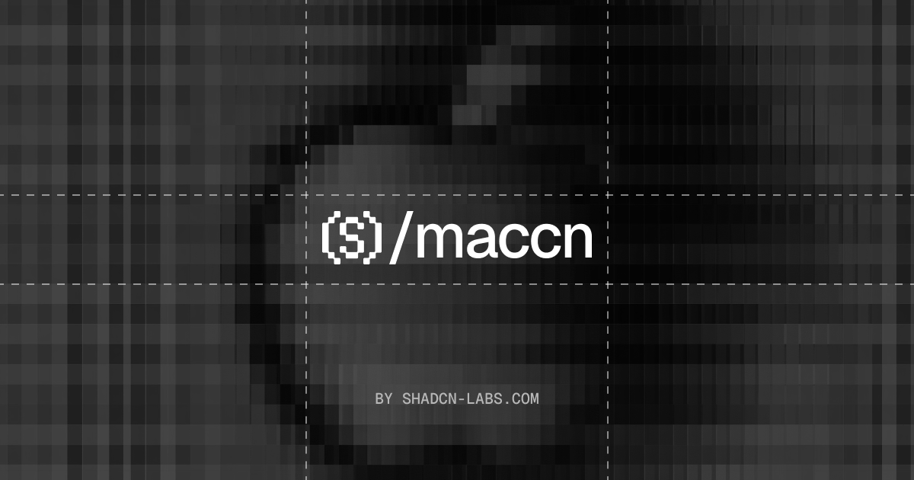

  

<h1 align="center">maccn</h1>

  macOS-inspired UI components for <a href="https://github.com/zed-industries/zed/tree/main/crates/gpui">GPUI</a>. 
  Zero config. One command setup. Follows the same layering as <a href="https://ui.shadcn.com">shadcn/ui</a>.

  
  
  

  <a href="https://maccn.vercel.app/docs">Get Started</a> ·
  <a href="https://maccn.vercel.app/docs/installation">Installation</a> ·
  <a href="https://maccn.vercel.app/docs/components">Components</a> ·

## Features

- 🍎 **19 components** — Badge, Box, Button, Checkbox, Glass Panel, Help Button, and more, with polished interactions and productive defaults.
- 📏 **Five control sizes** — `mini`, `small`, `regular`, `large`, and `extraLarge` on every control that has them
- 🌗 **Light and dark** — driven by a single theme on any element
- 🎨 **System accents** — every control follows one accent color

## Community

The maccn community lives on [GitHub](https://github.com/shadcn-labs/maccn), where you can ask questions, share ideas, and show what you've built.

## Contributing

Contributions are welcome. See [CONTRIBUTING.md](CONTRIBUTING.md) to get the repo running locally and land a change, and use [issues](https://github.com/shadcn-labs/maccn/issues) and [discussions](https://github.com/shadcn-labs/maccn/discussions) to collaborate. By participating, you agree to the [Code of Conduct](./CODE_OF_CONDUCT.md).

## Security

Please do not open public issues for security vulnerabilities. Follow [SECURITY.md](./SECURITY.md) and report them privately through GitHub Security Advisories.

## License

[MIT](LICENSE)

macOS and AppKit are trademarks of Apple Inc. This project is not affiliated with, endorsed by, or sponsored by Apple.

## Contributors

> Made with [contrib.rocks](https://contrib.rocks)

## Star History

<a href="https://www.star-history.com/?repos=shadcn-labs%2Fmaccn&type=date&legend=top-left">
 <picture>
   <source media="(prefers-color-scheme: dark)" srcset="https://api.star-history.com/chart?repos=shadcn-labs/maccn&type=date&theme=dark&legend=top-left&sealed_token=5krMkSaolIDM67oRAmloIrx5HOzAGlSFaPD7JZnJWUg_9b7no_HQcxxgVgVSNzw-C3UnmZVe5DPanlpiJ7mbHcyxm_FhvGbmPUnW0VB9VrVu-NcvYkKpd9j_fMx96WdkP7KTiql0PVh8E7l9Uid30pAKI9PFOCFOvUn9YsI7LMoH7JbcrsjctRV9friH" />
   <source media="(prefers-color-scheme: light)" srcset="https://api.star-history.com/chart?repos=shadcn-labs/maccn&type=date&legend=top-left&sealed_token=5krMkSaolIDM67oRAmloIrx5HOzAGlSFaPD7JZnJWUg_9b7no_HQcxxgVgVSNzw-C3UnmZVe5DPanlpiJ7mbHcyxm_FhvGbmPUnW0VB9VrVu-NcvYkKpd9j_fMx96WdkP7KTiql0PVh8E7l9Uid30pAKI9PFOCFOvUn9YsI7LMoH7JbcrsjctRV9friH" />
   
 </picture>
</a>
